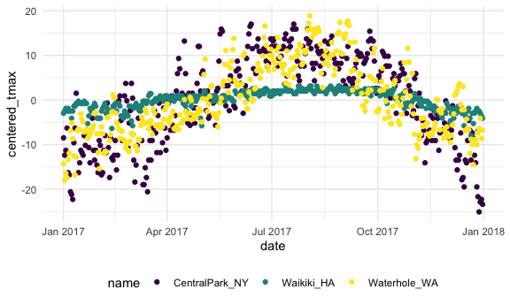

eda
================

``` r
library(tidyverse)
```

    ## ── Attaching packages ─────────────────────────────────────── tidyverse 1.3.1 ──

    ## ✓ ggplot2 3.3.5     ✓ purrr   0.3.4
    ## ✓ tibble  3.1.4     ✓ dplyr   1.0.7
    ## ✓ tidyr   1.1.3     ✓ stringr 1.4.0
    ## ✓ readr   2.0.1     ✓ forcats 0.5.1

    ## ── Conflicts ────────────────────────────────────────── tidyverse_conflicts() ──
    ## x dplyr::filter() masks stats::filter()
    ## x dplyr::lag()    masks stats::lag()

``` r
knitr::opts_chunk$set(
  fig.width = 6,
  fig.asp = .6,
  out.width = "90%"
)

theme_set(theme_minimal() + theme(legend.position = "bottom"))

options(
  ggplot2.continuous.colour = "viridis",
  ggplot2.continuous.fill = "viridis"
)

scale_colour_discrete = scale_colour_viridis_d
scale_fill_discrete = scale_fill_viridis_d
```

load in a dataset

``` r
weather_df =  
  rnoaa::meteo_pull_monitors(
    c("USW00094728", "USC00519397", "USS0023B17S"),
    var = c("PRCP", "TMIN", "TMAX"), 
    date_min = "2017-01-01",
    date_max = "2017-12-31") %>%
  mutate(
    name = recode(
      id, 
      USW00094728 = "CentralPark_NY", 
      USC00519397 = "Waikiki_HA",
      USS0023B17S = "Waterhole_WA"),
    tmin = tmin / 10,
    tmax = tmax / 10,
    month = lubridate::floor_date(date, unit = "month")) %>%
  select(name, id, everything())
```

    ## Registered S3 method overwritten by 'hoardr':
    ##   method           from
    ##   print.cache_info httr

    ## using cached file: ~/Library/Caches/R/noaa_ghcnd/USW00094728.dly

    ## date created (size, mb): 2021-10-05 10:31:01 (7.602)

    ## file min/max dates: 1869-01-01 / 2021-10-31

    ## using cached file: ~/Library/Caches/R/noaa_ghcnd/USC00519397.dly

    ## date created (size, mb): 2021-10-05 10:31:05 (1.697)

    ## file min/max dates: 1965-01-01 / 2020-02-29

    ## using cached file: ~/Library/Caches/R/noaa_ghcnd/USS0023B17S.dly

    ## date created (size, mb): 2021-10-05 10:31:08 (0.912)

    ## file min/max dates: 1999-09-01 / 2021-09-30

## `group_by`

``` r
weather_df %>% 
  group_by(name, month)
```

    ## # A tibble: 1,095 × 7
    ## # Groups:   name, month [36]
    ##    name           id          date        prcp  tmax  tmin month     
    ##    <chr>          <chr>       <date>     <dbl> <dbl> <dbl> <date>    
    ##  1 CentralPark_NY USW00094728 2017-01-01     0   8.9   4.4 2017-01-01
    ##  2 CentralPark_NY USW00094728 2017-01-02    53   5     2.8 2017-01-01
    ##  3 CentralPark_NY USW00094728 2017-01-03   147   6.1   3.9 2017-01-01
    ##  4 CentralPark_NY USW00094728 2017-01-04     0  11.1   1.1 2017-01-01
    ##  5 CentralPark_NY USW00094728 2017-01-05     0   1.1  -2.7 2017-01-01
    ##  6 CentralPark_NY USW00094728 2017-01-06    13   0.6  -3.8 2017-01-01
    ##  7 CentralPark_NY USW00094728 2017-01-07    81  -3.2  -6.6 2017-01-01
    ##  8 CentralPark_NY USW00094728 2017-01-08     0  -3.8  -8.8 2017-01-01
    ##  9 CentralPark_NY USW00094728 2017-01-09     0  -4.9  -9.9 2017-01-01
    ## 10 CentralPark_NY USW00094728 2017-01-10     0   7.8  -6   2017-01-01
    ## # … with 1,085 more rows

## count some things

``` r
weather_df %>% 
  group_by(month) %>%   ## group by `month`
  summarize(n_obs = n())  ## count the number of obs in each group.
```

    ## # A tibble: 12 × 2
    ##    month      n_obs
    ##    <date>     <int>
    ##  1 2017-01-01    93
    ##  2 2017-02-01    84
    ##  3 2017-03-01    93
    ##  4 2017-04-01    90
    ##  5 2017-05-01    93
    ##  6 2017-06-01    90
    ##  7 2017-07-01    93
    ##  8 2017-08-01    93
    ##  9 2017-09-01    90
    ## 10 2017-10-01    93
    ## 11 2017-11-01    90
    ## 12 2017-12-01    93

``` r
weather_df %>% 
  count(name)  ## easy way to do.
```

    ## # A tibble: 3 × 2
    ##   name               n
    ##   <chr>          <int>
    ## 1 CentralPark_NY   365
    ## 2 Waikiki_HA       365
    ## 3 Waterhole_WA     365

It is nice that summarize produces a data frame. `table` doesn’t and
that’s bad

``` r
weather_df %>% 
  pull(name) %>% 
  table()
```

    ## .
    ## CentralPark_NY     Waikiki_HA   Waterhole_WA 
    ##            365            365            365

This is a good way to do it!

``` r
weather_df %>% 
  janitor::tabyl(month, name)
```

    ##       month CentralPark_NY Waikiki_HA Waterhole_WA
    ##  2017-01-01             31         31           31
    ##  2017-02-01             28         28           28
    ##  2017-03-01             31         31           31
    ##  2017-04-01             30         30           30
    ##  2017-05-01             31         31           31
    ##  2017-06-01             30         30           30
    ##  2017-07-01             31         31           31
    ##  2017-08-01             31         31           31
    ##  2017-09-01             30         30           30
    ##  2017-10-01             31         31           31
    ##  2017-11-01             30         30           30
    ##  2017-12-01             31         31           31

## More general summaries.

Count, means, SDs

``` r
weather_df %>% 
  group_by(name, month) %>% 
  summarize(
    n_obs = n(),
    mean_tmax = mean(tmax, na.rm = TRUE),  ## removing missing values
    median_tmax = median(tmax, na.rm = TRUE),
    sd_tmax = sd(tmax, na.rm = TRUE)
  ) %>% 
  ggplot(aes(x = month, y = mean_tmax, color = name)) +
  geom_point() +
  geom_line()
```

    ## `summarise()` has grouped output by 'name'. You can override using the `.groups` argument.


`knitr::kable` is useful!

``` r
weather_df %>% 
  group_by(name, month) %>% 
  summarize(
    n_obs = n(),
    mean_tmax = mean(tmax, na.rm = TRUE),  ## removing missing values
    median_tmax = median(tmax, na.rm = TRUE),
    sd_tmax = sd(tmax, na.rm = TRUE)
  ) %>% 
  knitr::kable(digits = 2) ## this can make your table more readable when knitting your rmd
```

    ## `summarise()` has grouped output by 'name'. You can override using the `.groups` argument.

| name            | month      | n\_obs | mean\_tmax | median\_tmax | sd\_tmax |
|:----------------|:-----------|-------:|-----------:|-------------:|---------:|
| CentralPark\_NY | 2017-01-01 |     31 |       5.98 |         6.10 |     5.43 |
| CentralPark\_NY | 2017-02-01 |     28 |       9.28 |         8.30 |     6.02 |
| CentralPark\_NY | 2017-03-01 |     31 |       8.22 |         8.30 |     6.44 |
| CentralPark\_NY | 2017-04-01 |     30 |      18.27 |        18.30 |     5.85 |
| CentralPark\_NY | 2017-05-01 |     31 |      20.09 |        19.40 |     5.40 |
| CentralPark\_NY | 2017-06-01 |     30 |      26.26 |        27.25 |     4.65 |
| CentralPark\_NY | 2017-07-01 |     31 |      28.74 |        29.40 |     3.29 |
| CentralPark\_NY | 2017-08-01 |     31 |      27.19 |        27.20 |     2.91 |
| CentralPark\_NY | 2017-09-01 |     30 |      25.43 |        26.10 |     3.78 |
| CentralPark\_NY | 2017-10-01 |     31 |      21.79 |        22.20 |     3.97 |
| CentralPark\_NY | 2017-11-01 |     30 |      12.29 |        11.95 |     4.40 |
| CentralPark\_NY | 2017-12-01 |     31 |       4.47 |         3.90 |     6.43 |
| Waikiki\_HA     | 2017-01-01 |     31 |      27.76 |        27.80 |     1.28 |
| Waikiki\_HA     | 2017-02-01 |     28 |      27.22 |        27.20 |     1.33 |
| Waikiki\_HA     | 2017-03-01 |     31 |      29.08 |        29.40 |     1.58 |
| Waikiki\_HA     | 2017-04-01 |     30 |      29.71 |        30.00 |     1.15 |
| Waikiki\_HA     | 2017-05-01 |     31 |      30.11 |        30.60 |     1.37 |
| Waikiki\_HA     | 2017-06-01 |     30 |      31.31 |        31.10 |     0.55 |
| Waikiki\_HA     | 2017-07-01 |     31 |      31.76 |        31.70 |     0.58 |
| Waikiki\_HA     | 2017-08-01 |     31 |      32.02 |        32.20 |     0.51 |
| Waikiki\_HA     | 2017-09-01 |     30 |      31.74 |        31.70 |     0.47 |
| Waikiki\_HA     | 2017-10-01 |     31 |      30.29 |        30.60 |     1.29 |
| Waikiki\_HA     | 2017-11-01 |     30 |      28.38 |        28.30 |     1.35 |
| Waikiki\_HA     | 2017-12-01 |     31 |      26.46 |        26.70 |     1.57 |
| Waterhole\_WA   | 2017-01-01 |     31 |      -1.40 |         0.30 |     4.40 |
| Waterhole\_WA   | 2017-02-01 |     28 |      -0.02 |        -0.20 |     3.84 |
| Waterhole\_WA   | 2017-03-01 |     31 |       1.67 |         1.90 |     2.51 |
| Waterhole\_WA   | 2017-04-01 |     30 |       3.87 |         3.75 |     1.94 |
| Waterhole\_WA   | 2017-05-01 |     31 |      10.10 |        10.50 |     5.29 |
| Waterhole\_WA   | 2017-06-01 |     30 |      12.87 |        12.25 |     4.93 |
| Waterhole\_WA   | 2017-07-01 |     31 |      16.33 |        16.40 |     2.60 |
| Waterhole\_WA   | 2017-08-01 |     31 |      19.65 |        20.00 |     4.05 |
| Waterhole\_WA   | 2017-09-01 |     30 |      14.16 |        13.05 |     6.23 |
| Waterhole\_WA   | 2017-10-01 |     31 |       8.31 |         7.90 |     4.52 |
| Waterhole\_WA   | 2017-11-01 |     30 |       1.38 |         1.05 |     2.99 |
| Waterhole\_WA   | 2017-12-01 |     31 |       2.21 |         0.80 |     4.78 |

## grouped `mutate`

`group by` and `mutate`

``` r
weather_df %>% 
  group_by(name) %>% 
  mutate(
    mean_tmax = mean(tmax, na.rm = TRUE), ## if you `group` and then `mutate`, it calculated in each group.
    centered_tmax = tmax - mean_tmax, 
  ) %>% 
  ggplot(aes(x = date, y = centered_tmax, color = name)) +
  geom_point()
```

    ## Warning: Removed 3 rows containing missing values (geom_point).



**Windowed rank functions**

``` r
weather_df %>% 
  group_by(name) %>% 
  mutate(
    tmax_rank = min_rank(desc(tmax)) ## it's a group width mean because we group by name.
    ## `desc()` Transform a vector into a format that will be sorted in descending order.
  ) %>% 
  filter(tmax_rank < 2)
```

    ## # A tibble: 4 × 8
    ## # Groups:   name [3]
    ##   name           id          date        prcp  tmax  tmin month      tmax_rank
    ##   <chr>          <chr>       <date>     <dbl> <dbl> <dbl> <date>         <int>
    ## 1 CentralPark_NY USW00094728 2017-06-13     0  34.4  25   2017-06-01         1
    ## 2 CentralPark_NY USW00094728 2017-07-20     3  34.4  25   2017-07-01         1
    ## 3 Waikiki_HA     USC00519397 2017-07-12     0  33.3  24.4 2017-07-01         1
    ## 4 Waterhole_WA   USS0023B17S 2017-08-03     0  26.4  13.3 2017-08-01         1

**Lagged** variables

``` r
weather_df %>% 
  group_by(name) %>% 
  mutate(
    lagged_tmax = lag(tmax, n = 1), ## what is the tmax of yesterday.
    tmax_diff = tmax - lagged_tmax ## what is the change between 2 days.
  ) %>% 
  summarize(diff_sd = sd(tmax_diff, na.rm = TRUE))
```

    ## # A tibble: 3 × 2
    ##   name           diff_sd
    ##   <chr>            <dbl>
    ## 1 CentralPark_NY    4.45
    ## 2 Waikiki_HA        1.23
    ## 3 Waterhole_WA      3.13

## Limitations

What if my “summary” is a linear model…

``` r
weather_df %>% 
  group_by(name) %>% 
  summarize(cor_tmin_tmax = cor(tmin, tmax, use = "complete"))
```

    ## # A tibble: 3 × 2
    ##   name           cor_tmin_tmax
    ##   <chr>                  <dbl>
    ## 1 CentralPark_NY         0.955
    ## 2 Waikiki_HA             0.638
    ## 3 Waterhole_WA           0.939

``` r
weather_df %>% 
  filter(name == "CentralPark_NY") %>% 
  lm(tmax ~ tmin, data = .)  ## Fitting Linear Models use `lm`
```

    ## 
    ## Call:
    ## lm(formula = tmax ~ tmin, data = .)
    ## 
    ## Coefficients:
    ## (Intercept)         tmin  
    ##       7.209        1.039
