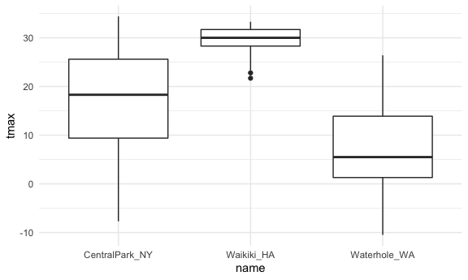

ggplot 1
================

``` r
library(tidyverse)
```

    ## ── Attaching packages ─────────────────────────────────────── tidyverse 1.3.1 ──

    ## ✓ ggplot2 3.3.5     ✓ purrr   0.3.4
    ## ✓ tibble  3.1.4     ✓ dplyr   1.0.7
    ## ✓ tidyr   1.1.3     ✓ stringr 1.4.0
    ## ✓ readr   2.0.1     ✓ forcats 0.5.1

    ## ── Conflicts ────────────────────────────────────────── tidyverse_conflicts() ──
    ## x dplyr::filter() masks stats::filter()
    ## x dplyr::lag()    masks stats::lag()

load in a dataset

``` r
weather_df = 
  rnoaa::meteo_pull_monitors(
    c("USW00094728", "USC00519397", "USS0023B17S"),
    var = c("PRCP", "TMIN", "TMAX"), 
    date_min = "2017-01-01",
    date_max = "2017-12-31") %>%
  mutate(
    name = recode(
      id, 
      USW00094728 = "CentralPark_NY", 
      USC00519397 = "Waikiki_HA",
      USS0023B17S = "Waterhole_WA"),
    tmin = tmin / 10,
    tmax = tmax / 10) %>%
  select(name, id, everything())
```

    ## Registered S3 method overwritten by 'hoardr':
    ##   method           from
    ##   print.cache_info httr

    ## using cached file: ~/Library/Caches/R/noaa_ghcnd/USW00094728.dly

    ## date created (size, mb): 2021-10-05 10:31:01 (7.602)

    ## file min/max dates: 1869-01-01 / 2021-10-31

    ## using cached file: ~/Library/Caches/R/noaa_ghcnd/USC00519397.dly

    ## date created (size, mb): 2021-10-05 10:31:05 (1.697)

    ## file min/max dates: 1965-01-01 / 2020-02-29

    ## using cached file: ~/Library/Caches/R/noaa_ghcnd/USS0023B17S.dly

    ## date created (size, mb): 2021-10-05 10:31:08 (0.912)

    ## file min/max dates: 1999-09-01 / 2021-09-30

## start with a familiar one

``` r
weather_df %>% 
  ggplot(aes(x = tmin, y = tmax, color = name)) +
  geom_point(alpha = .3) +
  labs(
    title = "Temperature at three stations",
    x = "Mininmum daily temp (C)",
    y = "Maximum daily temp (C)",
    caption = "Data from rnoaa package with three stations"
  ) +
  scale_x_continuous(
    breaks = c(-15, 0 ,15),
    labels = c("-15 C", "0", "15C")
  ) +
  scale_y_continuous(
    trans = "sqrt",
    position = "right"
  )
```

    ## Warning in self$trans$transform(x): NaNs produced

    ## Warning: Transformation introduced infinite values in continuous y-axis

    ## Warning: Removed 90 rows containing missing values (geom_point).

<!-- -->

Color scales

``` r
weather_df %>% 
  ggplot(aes(x = tmin, y = tmax, color = name)) +
  geom_point(alpha = .3) +
  labs(
    title = "Temperature at three stations",
    x = "Mininmum daily temp (C)",
    y = "Maximum daily temp (C)",
    caption = "Data from rnoaa package with three stations"
  ) + 
  scale_color_hue(
    name = "location",  ## for selected variable?
    h = c(100, 300)
    )
```

    ## Warning: Removed 15 rows containing missing values (geom_point).

<!-- --> Better
using package viridis!

``` r
library(viridis)
```

    ## Loading required package: viridisLite

``` r
weather_df %>% 
  ggplot(aes(x = tmin, y = tmax, color = name)) +
  geom_point(alpha = .3) +
  labs(
    title = "Temperature at three stations",
    x = "Mininmum daily temp (C)",
    y = "Maximum daily temp (C)",
    caption = "Data from rnoaa package with three stations"
  ) + 
  scale_colour_viridis_d()
```

    ## Warning: Removed 15 rows containing missing values (geom_point).

<!-- -->

## Themes

``` r
library(viridis)
weather_df %>% 
  ggplot(aes(x = tmin, y = tmax, color = name)) +
  geom_point(alpha = .3) +
  labs(
    title = "Temperature at three stations",
    x = "Mininmum daily temp (C)",
    y = "Maximum daily temp (C)",
    caption = "Data from rnoaa package with three stations"
  ) + 
  scale_colour_viridis_d() +
  theme_bw() +   ##change every default things to black and white
  theme(legend.position = "bottom")  ## if we put this above `theme_bw`, it doesn't matters, bcs bw only changes default things!
```

    ## Warning: Removed 15 rows containing missing values (geom_point).

<!-- --> use
ggthemes package …

``` r
library(viridis)
weather_df %>% 
  ggplot(aes(x = tmin, y = tmax, color = name)) +
  geom_point(alpha = .3) +
  labs(
    title = "Temperature at three stations",
    x = "Mininmum daily temp (C)",
    y = "Maximum daily temp (C)",
    caption = "Data from rnoaa package with three stations"
  ) + 
  scale_colour_viridis_d() +
  ggthemes::theme_excel() +
  theme(legend.position = "bottom")
```

    ## Warning: Removed 15 rows containing missing values (geom_point).

<!-- -->
`theme_minimal()`

``` r
weather_df %>% 
  ggplot(aes(x = tmin, y = tmax, color = name)) +
  geom_point(alpha = .3) +
  labs(
    title = "Temperature at three stations",
    x = "Mininmum daily temp (C)",
    y = "Maximum daily temp (C)",
    caption = "Data from rnoaa package with three stations"
  ) + 
  scale_colour_viridis_d() +
  theme_minimal() +
  theme(legend.position = "bottom")
```

    ## Warning: Removed 15 rows containing missing values (geom_point).

<!-- -->

which is always put at the beginning of our rmd file to setting things

``` r
library(tidyverse)

knitr::opts_chunk$set(
  fig.width = 6,
  fig.asp = .6,
  out.width = "90%"
)

theme_set(theme_minimal() + theme(legend.position = "bottom"))

options(
  ggplot2.continuous.colour = "viridis",
  ggplot2.continuous.fill = "viridis"
)

scale_colour_discrete = scale_colour_viridis_d
scale_fill_discrete = scale_fill_viridis_d
```

## `data` in geoms

``` r
central_park = 
weather_df %>% 
  filter(name == "CentralPark_NY")

waikiki = 
weather_df %>% 
  filter(name == "Waikiki_HA")

waikiki %>% 
  ggplot(aes(x = date, y = tmax, color = name)) +
  geom_point() +
  geom_line(data = central_park)  ## split a data set in two
```

    ## Warning: Removed 3 rows containing missing values (geom_point).


## `patchwork`

``` r
library(patchwork) ## load package

ggp_tmax_tmin = 
  weather_df %>% 
  ggplot(aes(x = tmin, y = tmax, color = name)) +
  geom_point(alpha = .3) +
  theme(legend.position = "none")

ggp_prcp_dens = 
  weather_df %>% 
  filter(prcp > 0) %>% 
  ggplot(aes(x = prcp, fill = name)) + 
  geom_density(alpha = .3) +
  theme(legend.position = "none")

ggp_tmax_date = 
  weather_df %>% 
  ggplot(aes(x = date, y = tmax, color = name)) +
  geom_point() +
  geom_smooth()

((ggp_tmax_tmin + ggp_prcp_dens) / ggp_tmax_date)
```

    ## Warning: Removed 15 rows containing missing values (geom_point).

    ## `geom_smooth()` using method = 'loess' and formula 'y ~ x'

    ## Warning: Removed 3 rows containing non-finite values (stat_smooth).

    ## Warning: Removed 3 rows containing missing values (geom_point).


## data manipulation

quick example on factors

``` r
weather_df %>% 
  mutate(
    name = fct_reorder(name, tmax) ## arrange factor "name" in the order according to "tmax" value
  ) %>% 
  ggplot(aes(x = name, y = tmax)) +
  geom_boxplot()
```

    ## Warning: Removed 3 rows containing non-finite values (stat_boxplot).


